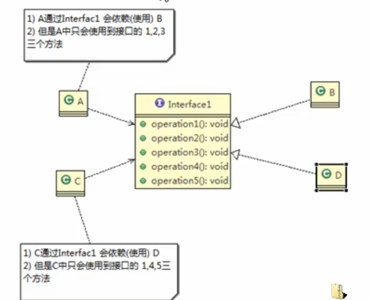
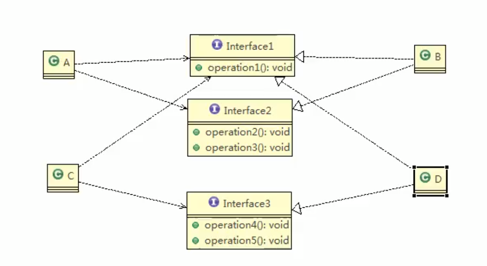

[TOC]


# 设计模式的目的

1. 提高代码的重用性：相同的代码不用多次编写。

2. 可读性

3. 可扩展性：需要添加新功能时很方便。

4. 可靠性：当新增功能时，对原有的功能不会有影响。

5. 使程序**高内聚低耦合**：这个是核心

# 设计模式的7大原则

1. 单一职责原则

2. 接口隔离原则

3. 依赖倒转原则

4. 里氏替换原则

5. 开闭原则

6. 迪米特法则

7. 合成复用原则

## 单一职责原则

单一职责原则，指一个类应该只负责一项职责。

例子如下：

假如交通工具存在run()方法，并且存在陆地交通工具与天空交通工具。设计这样子的工具类。

下面的例子就违反了单一职责原则：

```java
public class Vehicle{
    public void run1(String landVehicle){
        System.out.println(landVehicle+"在陆地运行");
    }
    public void run2(String airVehicle){
        System.out.println(airVehicle+"在天空运行");
    }
}
```

如此设计违反单一职责原则，正确设计如下。

```java
//定义一个抽象类
abstract class Vehicle{
    public abstract void run(String vehicle);
}


class AirVehicle extends Vehicle{
    public void run(String vehicle){
        System.out.println(vehicle+"在天空运行");
    }
}

class LandVehicle extends Vehicle{
    public void run(String vehicle){
        System.out.println(vehicle+"在陆地运行");
    }
}
```

## 接口隔离原则

一个类对另一个类的依赖应当建立在最小接口上的。

违反接口隔离原则例子：



接口B,D继承了接口1，A与C分别依赖B,D。但是A只会用到接口B中的1，2，3方法，4，5多余。B只会用到接口B中的1，4，5方法，2，3多余，这么设计就不满足最小接口原则。

正确设计如下：



将其拆成3个接口，这么设计满足接口隔离原则。

## 依赖倒转原则

1）  高层模块不应依赖于低层模块。

2）  抽象不应该依赖细节，细节应该依赖抽象

3）  中心思想就是面向接口编程，抽象指的是接口与实现类，细节指的是实现类

4）  使用接口，抽象类定义规范

总而言之，其思想就是面向接口编程。

## 里氏替换原则

如何正确使用接口？

里氏替换原则强调尽量不要重写父类的方法。

## 开闭原则

开闭原则是编程中最基础，最重要的设计原则。其总体思想是当软件需求发生变化时，尽量通过扩展软件的实体行为来实现变化，而不是通过修改已有代码来实现变化。


## 迪米特法则

一个对象应该对另一个对象有最少的了解。意思就是对象A需要使用对象B中method()方法，但是对象B中存在3个方法，除了method()方法其他都是内部依赖。这时候就只需要将method()方法设置成public，其他都需要设置成private。

## 合成复用原则

尽量使用组合，聚合的方式实现代码，而不是继承。