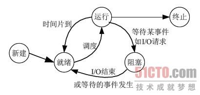

[TOC]

# 进程简介

进程是一个具有一定独立功能的程序关于某个数据集合的一次运行活动。它是操作系统动态执行的基本单元，在传统的操作系统中，进程既是基本的分配单元，也是基本的执行单元。

# 进程的生命周期

**就绪**(Ready)状态

当进程已分配到除CPU以外的所有必要的资源，只要获得处理机便可立即执行，这时的进程状态称为就绪状态。

**执行**（Running）状态
 当进程已获得处理机，其程序正在处理机上执行，此时的进程状态称为执行状态。

**阻塞**(Blocked)状态
 正在执行的进程，由于等待某个事件发生而无法执行时，便放弃处理机而处于阻塞状态。引起进程阻塞的事件可有多种，例如，等待I/O完成、申请缓冲区不能满足、等待信件(信号)等。

# 进程API

- fork()

一个进程，包括代码、数据和分配给进程的资源。fork（）函数通过系统调用创建一个与原来进程几乎完全相同的进程，也就是两个进程可以做完全相同的事，但如果初始参数或者传入的变量不同，两个进程也可以做不同的事。
一个进程调用fork（）函数后，系统先给新的进程分配资源，例如存储数据和代码的空间。然后把原来的进程的所有值都复制到新的新进程中，只有少数值与原来的进程的值不同。相当于克隆了一个自己。

- wait()

父进程一旦调用了wait就立即阻塞自己，由wait自动分析是否当前进程的某个子进程已经退出，如果让它找到了这样一个已经变成僵尸的子进程，wait就会收集这个子进程的信息，并把它彻底销毁后返回；如果没有找到这样一个子进程，wait就会一直阻塞在这里，直到有一个出现为止。

当父进程忘了用wait()函数等待已终止的子进程时,子进程就会进入一种无父进程的状态,此时子进程就是僵尸进程.

wait()要与fork()配套出现,如果在使用fork()之前调用wait(),wait()的返回值则为-1,正常情况下wait()的返回值为子进程的PID.

如果先终止父进程,子进程将继续正常进行，只是它将由init进程(PID 1)继承,当子进程终止时,init进程捕获这个状态.

- exec()

用fork函数创建子进程后，子进程往往要调用一种exec函数以执行另一个程序。当进程调用一种exec函数时，该进程执行的程序完全替换为新程序，而新程序则从其main函数开始执行。因为调用exec并不创建新进程，所以前后的进程ID并未改变。exec只是用一个全新的程序替换了当前进程的正文、数据、堆和栈段。

## 为什么这么设计API

这与shell有关，一旦运行一个命令，就需要fork() exec()和wait()这3个系统调用进行协调，首先用fork()创建一个进程，然后用exec()执行线程，最后用wait()阻塞父线程。

# 用户态与内核态

## 为什么需要用户态与内核态？

如果没有内核态，用户进程可以直接对硬件进行操作，那么在操作系统权限管理这个功能就非常难办，我们不同用户对操作系统有不同权限。比如有些用户不能使用io操作。

## 用户态转内核态的过程

当使用系统调用，中断或者异常的时候，程序会从用户态变为内核态。

要执行系统调用，程序必须执行特殊的陷阱指令。该指令同时跳入内核，并将特权级别提升到内核模式。一旦进入内核，系统就可以执行任何需要的特权操作。完成后，操作系统调用一个特殊的从陷阱返回的指令，该指令返回到发起调用的用户程序中，同时将特权级降低，回到用户模式。

## 操作系统如何获取cpu的使用权？

众所周知，如果cpu的使用权一直在用户进程手中，那么操作系统就无法运行。那么操作系统如何获取cpu指令权？

1. yield显式放权。

2. 执行非法操作，如被除数是0

3. 假如有恶意程序，如while true一直霸占cpu资源而不交予操作系统执行，怎么办？第一就是重启，第二就是利用时钟中断。时钟中断是独立与操作系统的一套硬件系统，允许操作系统每隔n毫秒进行中断cpu，执行中断函数，可以在中断函数中进行相关设置。

## 上下文切换的过程

1. 时钟中断

2. 将寄存器A中的值保存到内核栈（保存用户态信息）

3. 转向内核模式

4. 调用切换进程的内核处理程序，将寄存器（A）保存到进程结构（A），将进程结构（B）恢复到寄存器（B），返回用户态

5. 从内核栈（B）恢复寄存器（B）（还原用户态信息）

6. 跳到B程序计数器

# 进程调度

那么cpu以什么策略在两个进程之间切换呢？

## 先进先出

简单就是说ABC三个进程，谁先来就先执行谁。但这种算法存在缺陷，也就是护航效应，一些耗时较少的潜在资源消费者排在重量级消费者之后。

## 最短任务优先（SJF）

优先运行最短的任务，然后是次短的任务。但是不可抢占会存在如下问题，也就是如果A先来需要100s之后b来了只需要10s，B仍然需要A执行完毕后才能再次执行B

 

## 抢占式最短任务优先

在每个时钟中断的时间片中比较任务队列中队列的最短任务，如果最短任务不是当前任务，则直接抢占。但是这种调度算法对响应时间与交互性是不好的，比如假设你在终端前输入，不得不等待10s才能看到系统的回应，只是因为其他工作在你之前被调度。

 

## 轮转

思想很简单，分配一个固定时间，在这个时间片中按队列顺序运行任务。也叫作公平调度，但是，公平调度也是存在弊端的，也就是对周转时间不利，假如说ABC分别15s，那么如果使用轮转调度算法，A在13s完成，B在14s完成，C在15s完成，那么，这是很可怕的。

说了这么多，最根本的问题出现了，那就是你怎么预测这个任务他的长度呢？这就需要用到多级反馈队列

## 多级反馈队列

多级反馈队列（MLFQ）需要解决2个问题：

1. 通常我们对进程一无所知，应该如何构建调度程序来实现这些目标？

2. 调度程序如何在运行过程中学习进程的特征，从而做出调度决策？

 ### 基本规则

MLFQ有许多独立队列，每个队列有不同优先级，任何时刻，一个工作只能存在一个队列中，MLFQ总是优先执行较高优先级的工作。总结一下如下：

1. 如果A的优先级大于B的优先级，则运行A不运行B。

2. 如果A的优先级=B的优先级，轮转运行A与B。

### 优先级变化

每个任务的优先级是动态改变的，那么如何改变优先级也是一大问题。这里有三大规则：

1. 任务进入MLFQ时放在最高优先级。

2. 任务消耗完整的时间片后，降低其优先级（移入下一队列）

3. 如果任务在其时间片内主动释放CPU，则优先级不变。

 

规则1和2的目的很简单，就是将单个长工作的优先级降低，符合SJF的思想。

规则3的目的假设交互型工作中有大量IO操作，他会在时间片用完之前放弃CPU进入阻塞状态，我们不希望处罚他，所以不减优先级。

但是这种调度又会存在严重的问题，也就是饥饿问题。如果有大量短的交互型工作，那么会永远霸占cpu，长的计算密集型的工作永远得不到cpu时间片。

 

于是有了一条规则

4. 经过一段时间S后，将所有任务调至最高优先级。

然而，即使如此设计也是存在不完美的地方，也就是假如一个程序io密集，就会不停的抢占资源。我们需要将规则2和三替换成如下规则：

每个任务在每个队列中存在执行时间配额，一旦工作中用完了其在某一层中的时间配额（无论中间出现多少次io，就降低其优先级）

### 最终版的MLFQ的规则如下：

1）  任务进入MLFQ时放在最高优先级。

2）  每个任务在每个队列中存在执行时间配额，一旦工作中用完了其在某一层中的时间配额（无论中间出现多少次io），就降低其优先级。

3）  经过一段时间S后，将所有任务调至最高优先级。