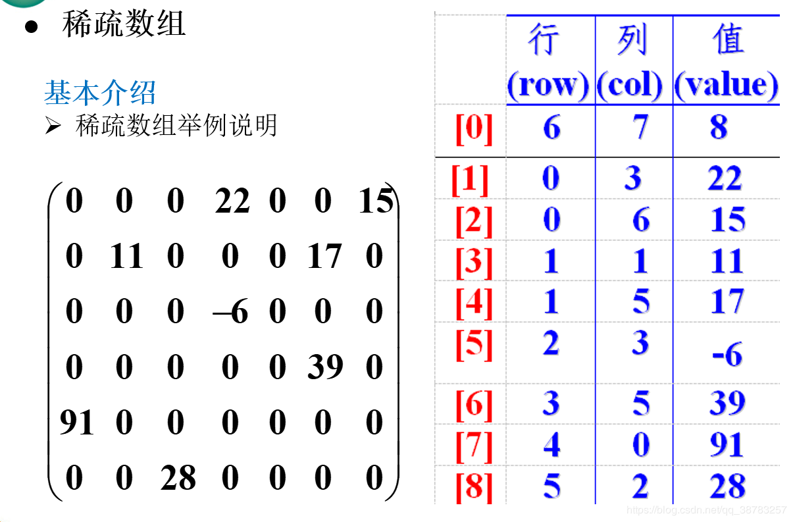

[TOC]

# 数组和链表的区别

数组：就是相同数据类型的元素按一定顺序排列的集合。数组的存储区间是连续的。

链表：链表是一种物理存储单元上非连续、非顺序的存储结构，数据元素的逻辑顺序是通过链表中的指针链接次序实现的。每个结点包括两个部分：一个是存储数据元素的数据域，另一个是存储下一个结点地址的指针域。

区别：

数组：查询快O(1)搞定，删除插入效率低需要O(n)。

链表：删除插入效率高，需要O(1)，查询效率低需要O(n)

# 稀疏数组

当一个二维数组有许多重复值的时候，就可以使用稀疏数组来压缩数据。
稀疏数组的处理方法：

1. 记录数组一共有几行几列。
2. 把具有不同值的元素的行列以及值记录在一个小规模的数组中，从而缩小程序的规模。

左边是普通的二维数组，里面有许多个0，重复占用空间，这时就需要使用稀疏数组来对其进行优化。

稀疏数组第一行的第一个值记录有n行，第一行的第二个值记录有m列，第一行的第三个值记录一共有x个地方有值。
接下来的x行记录了第几行第几列有具体的值。

# 栈与队列

队列可以用**数组**或**链表**实现，遵循**先进先出(FIFO)**的原则。

栈是一个**先入后出(FILO)**的有序列表，最先放入的数据在栈底，最后放入的元素在栈顶，最后放入的元素先删除，最先放入的先删除。

