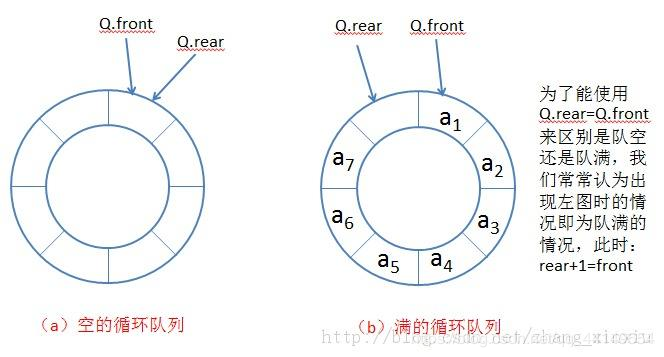

[TOC]


# 数组实现栈

```java
public class Stack {
    private int[] stack;
    private int top;
    private int maxSize;
    public Stack(int maxSize){
        this.stack=new int[maxSize];
        this.maxSize=maxSize;
        this.top=0;
    }

    public boolean isFull(){
        return top==maxSize;
    }

    public boolean isEmpty(){
        return top==0;
    }

    public boolean push(int value){
        if(isFull()) return false;
        this.stack[top]=value;
        top++;
        return true;
    }

    public Integer pop(){
        if(isEmpty()) return null;
        int value=stack[top];
        top--;
        return value;
    }
}
```

# 实现循环队列



可以有效的利用资源。用数组实现队列时，如果不移动，随着数据的不断读写，会出现假满队列的情况。即尾数组已满但头数组还是空。循环队列也是一种数组，只是它在逻辑上把数组的头和尾相连，形成循环队列，当数组尾满的时候，要判断数组头是否为空，不为空继续存放数据。

```java
public class Queue {
    private int[] queue;
    private int maxSize;
    private int front;
    private int rear;
    public Queue(int maxSize){
        this.maxSize=maxSize;
        this.queue=new int[maxSize+1];
        this.front=0;
        this.rear=0;
    }

    public boolean isEmpty(){
        return rear==front;
    }

    public boolean isFull(){
        return front==(rear+1)%(maxSize+1);
    }

    public boolean enQueue(int value){
        if(isFull()) return false;
        queue[rear]=value;
        rear=(rear+1)%(maxSize+1);
        return true;
    }

    public Integer deQueue(){
        if(isEmpty()) return null;
        int value=queue[front];
        front=(front+1)%(maxSize+1);
        return value;
    }

}
```

# 中缀表达式的计算

比如计算：3+2*6-2
算法步骤如下：

维护2个栈数字栈和符号栈

1. 从前往后扫描如果遇到数字，直接入数字栈。

2. 如果遇到符号分为以下3种情况：

- 如果符号栈为空，直接入栈。
- 如果符号栈不为空且符号优先级小于或等于栈顶元素，那么pop出两个数字运算，然后将结果重新入栈。
- 如果符号栈不为空且符号优先级大于栈顶元素，符号直接入栈

牛客网地址：https://www.nowcoder.com/questionTerminal/7b18aa6b7cc14f8eaae6b8acdebf890b?toCommentId=103161

```java
import java.util.Scanner;
import java.util.Stack;

public class Main {
    public static void main(String[] args) throws Exception {
        Scanner cin = new Scanner(System.in);
        Main m=new Main();
        while (cin.hasNext()){
            String exp=cin.next();
            float res=m.nifix(exp);
            System.out.println((int)res);
        }

    }
    public float nifix(String expression){
        Stack<Float> numberStack=new Stack<>();
        Stack<Character> symbolStack=new Stack<>();
        String digit="";
        for(int i=0;i<expression.length();i++){
            char x=expression.charAt(i);
            if(Character.isDigit(x)){
                digit+=String.valueOf(x);
                if(i+1>=expression.length()||!Character.isDigit(expression.charAt(i+1))){
                    numberStack.push(Float.parseFloat(digit));
                    digit="";
                }

            }else {
                while (!symbolStack.isEmpty()&&priority(symbolStack.peek())>=priority(x)){
                    char y=symbolStack.pop();
                    float res=calRes(y,numberStack.pop(),numberStack.pop());
                    numberStack.push(res);
                }
                symbolStack.push(x);
            }
        }
        while (!symbolStack.isEmpty()){
            char y=symbolStack.pop();
            float res=calRes(y,numberStack.pop(),numberStack.pop());
            numberStack.push(res);
        }
        return numberStack.pop();
    }
    //判断符号的优先级
    private int priority(char x){
        if(x =='+'|| x =='-'){
            return 1;
        }else{
            return 2;
        }

    }
    //计算结果
    private float calRes(char x,float num1,float num2){
        float res=0;
        switch (x){
            case '+':
                res=num1+num2;
                break;
            case '-':
                res=num2-num1;
                break;
            case '*':
                res=num1*num2;
                break;
            case '/':
                res=num2/num1;
                break;
        }
        return res;

    }
}
```

# 后缀表达式的计算

后缀表达式的例子：
(3+4)x5-6对应的后缀表达式就是34+5x6-。
计算机处理后缀表达式是很直接的，维护一个栈就可以完成计算。

```java
import java.util.Scanner;
import java.util.Stack;

public class Main {
    public static void main(String[] args) throws Exception {
        Scanner cin = new Scanner(System.in);
        Main m=new Main();
        while (cin.hasNext()){
            String exp=cin.next();
            float res=m.postfix(exp);
            System.out.println((int)res);
        }

    }
    public float postfix(String expression){
        String[] expressionItem=expression.split(" ");
        Stack<Float> stack=new Stack<>();
        for(int i=0;i<expressionItem.length;i++){
            String item=expressionItem[i];
            if(isNumeric(item)){
                stack.push(Float.parseFloat(item));
            }else {
                stack.push(cal(item,stack.pop(),stack.pop()));
            }

        }
        return stack.pop();
    }
    private static boolean isNumeric(String str){
        for (int i = str.length();--i>=0;){
            if (!Character.isDigit(str.charAt(i))){
                return false;
            }
         }
        return true;
    }
    //计算结果
    private float cal(String item,float num1,float num2){
        float res=0;
        if(item.equals("+")){
            res=num2+num1;
        }else if(item.equals("-")){
            res=num2-num1;
        }else if(item.equals("/")){
            res=num2/num1;
        }else if(item.equals("*")){
            res=num2*num1;
        }
        return res;

    }
}
```

